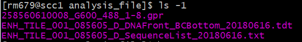
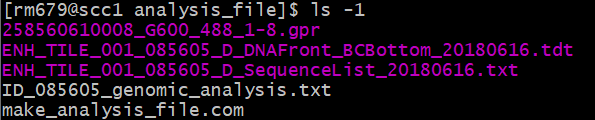
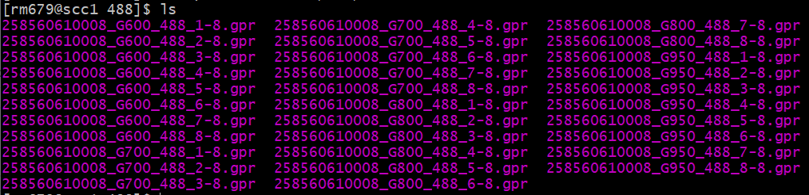
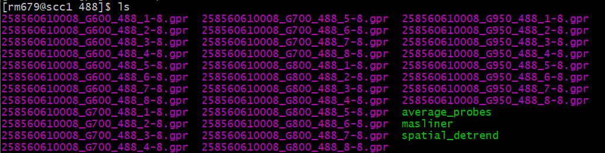
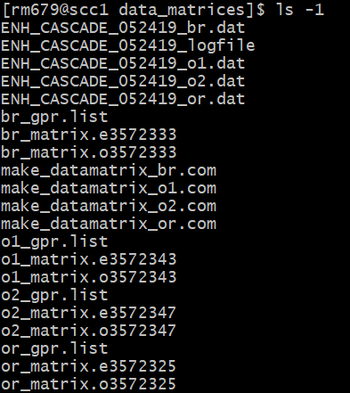

# auto_PBM_prepro
## Introduction
This pipeline performs all steps necessary to generate data matrices from the GPR files from a protein-binding microarray (PBM) experiment. There are five main steps in this process.

1. Making an analysis file: <br>
The analysis file relates the spot coordinates of the PBM with their DNA sequences. This step is necessary only the first time an array design is used; the same analysis file can then be reused for all subsequent analyses using this design.
2. Running masliner: <br>
Masliner ‘stitches’ together scans that were performed at multiple intensities. Multiple scans at different intensities (gains) should be performed when the dynamic range of the PBM spots is so large that at some laser settings the low intensity spots are barely visible but the high intensity spots are already saturated. Masliner uses the fact that fluorescence values change linearly with increasing scan intensity to combine GPR files run at different gains.
3. Spatial detrending: <br>
The spatial detrending process normalizes different regions of the scan to a common median. In other words, if a portion of the scan was generally dimmer, the intensities for the spots in this area can be adjusted up a little. This approach is based on the idea that, on average, sufficiently large areas of the scan should have the same median values. This step uses the masliner adjusted GPR files.
4. Averaging probe intensities over replicates and orientations: <br>
This step combines the values from different probes in three different ways. First, it averages over both replicates and probe orientations; second, it averages over replicates while keeping probe orientations separate; and third, it averages over replicates while keeping probe orientations separate and then takes the top orientation for each probe. This step uses the spatially detrended GPR files.
5. Making data matrices: <br>
This step collates the values for each spot into a matrix. It makes four separate data matrices using the values from the four separate types of files generated when averaging probes.

The pipeline will also generate a log file recording progress and error messages as it runs. This file will be saved in the same user-specified directory as the output data matrices.

## Dependencies
The pipeline requires Python 3. To ensure Python 3 is loaded on the SCC, run the following command prior to using the pipeline:
```
module load python3
```

## Usage
To run the pipeline, use the following command:
```
python preprocess_pipeline.py -a ANALYSIS_DIR -g GPR_DIRS [GPR_DIRS ...] -o OUTPUT_DIR -p PREFIX [options]
```
NOTE: You do NOT need to submit this as a batch job using the qsub command; the pipeline itself will submit batch jobs for any steps that require it.

## Arguments
There are four required arguments and two optional arguments for the pipeline, described below.
| Flag |     Name     | Required | Description |
|------|--------------|----------|-------------|
|  -a  | analysis_dir |    Yes   | the full path to the directory where the analysis file is saved OR should be created |
|  -g  |   gpr_dirs   |    Yes   | the full path(s) to the directory or directories containing the GPR files to analyze |
|  -o  |  output_dir  |    Yes   | the full path to the directory in which to save the output data matrix files |
|  -p  |    prefix    |    Yes   | the prefix to add to the names of the output data matrix files |
|  -e  |    exclude   |    No    | the list of GPR files to exclude from analysis (default: None) |
|  -r  |   r2cutoff   |    No    | the minimum acceptable value for the R<sup>2</sup> values in the masliner output (default: 0.9) |

### analysis_dir 
*the full path to the directory where the analysis file is saved OR should be created*

This directory has two options.

1. It must contain the analysis file to use. <br>
This file's name must be of the form "\*analysis\*.txt", and there must be only one file in this directory of this form.
2. It must contain the three files necessary to create a new analysis file. <br>
"\*DNAfront_BCBottom\*.txt". There must be exactly one file of this form in the directory. <br>
"\*SequenceList\*.txt". There must be exactly one file of this form in the directory. <br>
"\*.gpr". There must be at least one file of this form in the directory.

If this is the first time an array design has been used, a new directory should be created to store the analysis file. The first two files required to make a new analysis file can be downloaded from the [Agilent SureDesign](https://earray.chem.agilent.com/suredesign/) website. The third file can be copied from one of the directories containing the GPR files associated with the array design. It is recommended that only one GPR file be copied to this directory.

### gpr_dirs
*the full path(s) to the directory or directories containing the GPR files to analyze*

This directory or these directories must contain the GPR files to analyze, separated by wavelength. Generally, there will be two directories, one at a wavelength of 488 and one at a wavelength of 635/647. In some cases, there may be only the 488 directory. The pipeline will use all files in these directories of the form "\*.gpr" except those provided to the exclude argument. To ensure proper sorting of the GPR files, the filenames must list the laser power setting before the gain setting.

### output_dir
*the full path to the directory in which to save the output data matrix files*

This directory will be created if it does not already exist. If it does already exist, it should be empty. After running the pipeline, this directory will contain the output data matrices as well as several files used to generate them and the log file.

### prefix
*the prefix to add to the names of the output data matrix files*

This string will get added to the beginning of all data matrix files saved in output_dir as well as the log file.

### exclude
*the list of GPR files to exclude from analysis (default: None)*

These files will be ignored when running masliner and thus excluded from the analysis. Filenames must be provided WITHOUT the path (i.e. 258560610008_G600_488_1-8.gpr instead of /projectnb/siggers/data/rebekah_project/auto_pipeline/gpr/488/258560610008_G600_488_1-8.gpr). 

### r2cutoff
*the minimum acceptable value for the R<sup>2</sup> values in the masliner output (default: 0.9)*

All R<sup>2</sup> values listed in the masliner output files must be above this value. If any are below, the pipeline will abort and ask you to choose additional files to exclude from analysis using the exclude argument. NOTE: Before rerunning the pipeline in this situation, you will need to remove the newly created masliner directories and their contents as well as the contents of output_dir.

## Example 1
The following is an example of how the pipeline could be called:
```
python preprocess_pipeline.py -a /projectnb/siggers/data/rebekah_project/auto_pipeline/analysis_file/ -g /projectnb/siggers/data/rebekah_project/auto_pipeline/gpr/488/ /projectnb/siggers/data/rebekah_project/auto_pipeline/gpr/647/ -o /projectnb/siggers/data/rebekah_project/auto_pipeline/data_matrices/ -p ENH_CASCADE_052419
```

The contents of the analysis file directory (/projectnb/siggers/data/rebekah_project/auto_pipeline/analysis_file/) were as shown below before running the pipeline using this array design for the first time.



After running the pipeline and in all subsequent analyses using the same array design, the contents will instead be as shown below. Note that the files used to create the analysis file are still present. There is no need to remove them as the pipeline will detect the analysis file and then ignore other files in this directory.



The contents of each GPR file directory were as shown below prior to running the pipeline.



After running the pipeline, each GPR file directory will have three new subdirectories containing the intermediate files generated in steps 2 through 4, as shown below.



The output directory, which should initially be empty or not exist at all, will contain the files shown below after running the pipeline. Note that the names of the data matrix files ("ENH_CASCADE_052419_\*.dat") depend on the user-specified prefix.



## Example 2
The following command shows how the pipeline could be called to exclude certain GPR files and require the R<sup>2</sup> values in the masliner output to be above 0.95:
```
python preprocess_pipeline.py -a /projectnb/siggers/data/rebekah_project/test_masliner/analysis_file/ -g /projectnb/siggers/data/rebekah_project/test_masliner/gpr/488/ /projectnb/siggers/data/rebekah_project/test_masliner/gpr/647/ -o /projectnb/siggers/data/rebekah_project/test_masliner/data_matrices/ -p ENH_CASCADE_v2_081519 -e 25859890002_lp50_g750_647_3-8.gpr 25859890002_lp50_g750_647_4-8.gpr -r 0.95
```
Again, note that you must not include the path in the filenames provided to the exclude argument.
